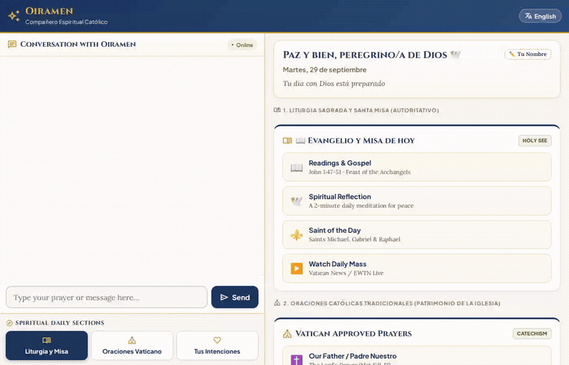

# Oiramen · Catholic Spiritual Companion (Compañero Católico)

> A compassionate, reverent Catholic spiritual companion that accompanies believers—particularly elderly individuals, families, and parish communities—acting as a personal guide for daily prayer, Sacred Scripture, daily Mass participation, and persistent prayer intentions.



---

## What Oiramen Actually Does

Oiramen is built on the **Google Agent Development Kit (ADK)** and deployed on **Google Cloud Agent Platform (Vertex AI Agent Engine)** using the `gemini-2.5-flash` model. It serves two distinct tiers of content with pastoral boundaries:

1. **Authoritative Liturgical Content (Sacred Catholic Heritage)**:
   - Fetches the official daily Gospel, biblical citations, and Catholic liturgical feast of the day from the Roman Missal.
   - Provides authoritative traditional prayers approved by the Holy See and Catechism of the Catholic Church (*Our Father*, *Hail Mary*, *Glory Be*, *Act of Spiritual Communion*, *Salve Regina*, *Saint Michael the Archangel Prayer*).
   - Links to daily Catholic Holy Mass live streams (CatholicTV / EWTN).
   - Looks up Catholic patron saints and their intercessory prayers based on user petitions or calendar feast days.

2. **Personalized Pastoral Accompaniment**:
   - Delivers brief (1–2 paragraph) warm, spiritually grounded reflections for the day's readings.
   - Listens to personal worries, anxieties, illnesses, and milestones, composing customized prayers of intercession commending the user and their loved ones into God's hands.
   - Extracts and structures prayer petitions into **Active Intentions** and persists them across conversations.
   - Generates and presents dedicated Vatican-style **Holy Prayer Cards (*"Estampas de Oración"*)** with gilded baroque angelic artwork and biblical blessings.
   - Supports seamless bilingual communication in **English** and **Español**.

---

## Google Cloud & Vertex AI Services Wired Up

Based directly on the codebase in `app/agent.py` and `app/companion_tools.py`, the following cloud services are implemented and active:

| Google Cloud Service | Purpose in Codebase | Implementation Details |
| :--- | :--- | :--- |
| **Vertex AI Memory Bank** | Cross-session long-term memory | Wired via `PreloadMemoryTool()` and `generate_memories_callback` (`add_session_to_memory`) to remember user names, preferred languages, and previous interactions across sessions. |
| **Google Cloud Firestore** | Prayer intentions persistence | Managed in `app/companion_tools.py` via `google-cloud-firestore` (`prayer_intentions` collection) to store categories, persons, events, target dates, and statuses. |
| **Google Cloud Storage (GCS)** | Devotional media bucket | Bucket `oiramen-catholic-companion-media-7319` stores baseline and custom-generated prayer cards (*Estampas de Oración*). |
| **Vertex AI Image Generation (Google GenAI SDK)** | Dynamic Holy Card generation | `generate_custom_prayer_card_image` uses `google-genai` on Vertex AI (`imagen-3.0-generate-002` / `gemini-2.5-flash-image`) to create personalized Vatican sacred art for prayer petitions. |
| **Vertex AI Agent Engine Sandbox** | Secure Python execution | Configured via `AgentEngineSandboxCodeExecutor` and `execute_sandboxed_python` to compute liturgical calendar dates (Easter offsets, Lent, Advent, feast intervals) in a secure isolated environment. |
| **Agent-to-Agent (A2A) Protocol** | Client-to-Agent communication | Implemented over JSON-RPC 2.0 via `fast_api_app.py` and proxied through `frontend/main.py` using Application Default Credentials (ADC). |

> [!NOTE]
> **A2UI Status**: The repository uses a custom Marian-sanctuary responsive web frontend (FastAPI + HTML5/CSS3) communicating over A2A JSON-RPC. Native ADK A2UI JSON card schemas were planned in the original brief, but are not yet implemented in favor of the custom interactive web interface.

---

## Implemented Agent Tools

The root agent (`oiramen`) in `app/agent.py` is equipped with the following verified function tools:

- `PreloadMemoryTool`: Automatically loads durable user memories from Vertex AI Memory Bank upon session start.
- `get_daily_liturgical_readings`: Retrieves the Catholic Gospel reading, liturgical color, feast day title, and citation.
- `get_daily_mass`: Retrieves links and stream information for today's Catholic Holy Mass.
- `save_prayer_intention`: Extracts structured fields (`user_name`, `person`, `event`, `target_date`, `category`) and saves the intention to Firestore, automatically attaching a holy card.
- `get_user_prayer_intentions`: Queries Firestore to retrieve active prayer intentions for a user to follow up on key dates.
- `get_traditional_prayer`: Provides the exact, unaltered texts of traditional Vatican prayers in English or Spanish.
- `get_saint_of_the_day`: Retrieves patron saints and intercessory prayers matching the day or specific user concerns (healing, lost items, urgent causes, travel).
- `generate_custom_prayer_card_image`: Synthesizes dedicated prayer cards and uploads them to Cloud Storage.
- `execute_sandboxed_python`: Safely runs Python code inside the Vertex AI Agent Engine Sandbox to compute liturgical calculations.

---

## Project Structure

```
.
├── app/
│   ├── __init__.py
│   ├── agent.py               # Root ADK agent configuration & system instructions
│   ├── companion_tools.py     # Firestore, GCS, liturgical, and sacred art tools
│   ├── fast_api_app.py        # FastAPI A2A server integration
│   └── app_utils/             # A2A runners and service helpers
├── frontend/
│   ├── main.py                # FastAPI proxy server (ADC auth & A2A JSON-RPC bridge)
│   ├── requirements.txt       # Frontend dependencies
│   └── static/
│       └── index.html         # Sanctuary web UI (bilingual, 2-column layout)
├── agents-cli-manifest.yaml   # Agent Engine deployment manifest
├── deployment_metadata.json   # Remote Agent Runtime and Sandbox resource IDs
├── demo.gif                   # Looping walkthrough recording
└── README.md
```

---

## Local Setup & Run Instructions

### Prerequisites
- Python 3.10+
- Google Cloud SDK (`gcloud`) installed and logged in:
  ```bash
  gcloud auth login
  gcloud auth application-default login
  ```
- Active Google Cloud project with Vertex AI and Firestore APIs enabled.

### 1. Set Up Environment & Dependencies

From the project root:

```bash
# Create and activate virtual environment
python3 -m venv .venv
source .venv/bin/activate

# Install core agent dependencies
pip install -r app/requirements.txt

# Install frontend dependencies
pip install -r frontend/requirements.txt
```

### 2. Configure Environment Variables

Create a `.env` file in the project root:

```env
GOOGLE_GENAI_USE_VERTEXAI=true
GOOGLE_CLOUD_PROJECT=your-gcp-project-id
GOOGLE_CLOUD_LOCATION=us-central1
```

### 3. Start the Web Frontend & Proxy

Launch the local web server from the `frontend/` directory:

```bash
cd frontend
export AGENT_ENGINE_RESOURCE_NAME="projects/YOUR_PROJECT_ID/locations/us-central1/reasoningEngines/YOUR_REASONING_ENGINE_ID"
export AGENT_DIRECTORY="app"
export PORT=8080

python main.py
```

Open your browser to the local port configured above (default is port 8080) to interact with Oiramen in English or Spanish.

### 4. Running the Agent Playground (Alternative)

To test the agent directly in the ADK Developer UI with Memory Bank connected:

```bash
uv run adk web . --port 8080 --reload_agents --memory_service_uri=agentengine://YOUR_AGENT_ENGINE_ID
```
